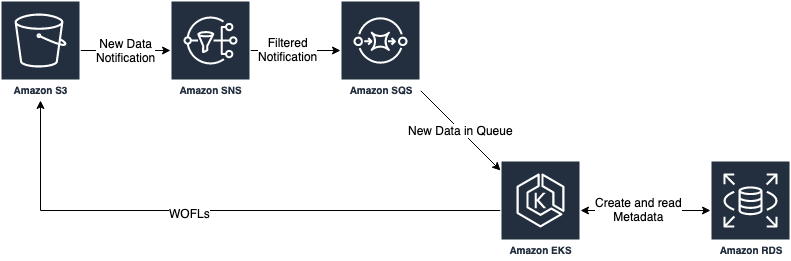
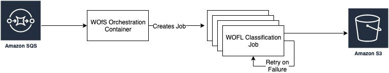

# WOFLs Orchestration

This Repository defines Docker and Kubernetes components to convert ARD data to WOFLs

---
# Requirements

- AWS Simple Queue Service - This queue is used to identify new ARD .yaml files as they become available
- AWS S3 Bucket - This is the output location for the new WOFLs files
- IAM Permissions - This is used to read from SQS and write to S3

---
# Architecture
## Infrastructure Architecture

This is an example of the architecture that is required to run the orchestrator

## Application Architecture

This is an overview of the architecture we'll be creating

---
# Process

The Orchestration component will monitor the SQS queue for new ARD data, when it discovers new data it will kick off a new Job to create WOFLs, by passing the new .yaml data to the template.

When the new job starts it will classify the data and save the result to AWS S3
If the job fails it will be restarted.

# Notes and Todos
## WOfS
This process has set bit flags for the WOfS dataset. There are a number that need to be added still, including `contiguity` and the `terrain` flags.